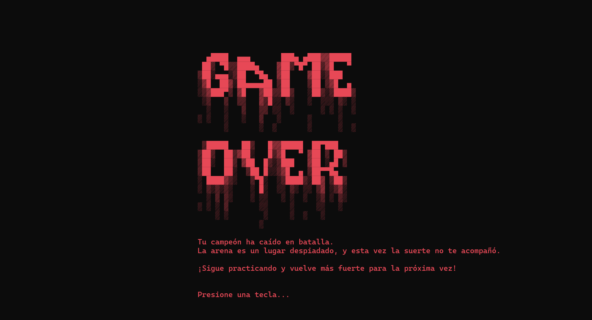

## Taller de Lenguajes 1 - Proyecto Final - Miguel Juárez
# Battle Royal - Un juego de consola C# con un toque de League of Legends

Este juego te sumerge en un emocionante Battle Royal donde podrás elegir a tu campeón favorito de League of Legends y luchar por la supervivencia contra otros poderosos personajes.

## Mecánica del juego:

El juego se desarrolla en una serie de rondas. En cada ronda, tu campeón se enfrentará a un oponente aleatorio en un combate por turnos. El daño se calcula en base a las estadísticas del campeón (obtenidas de la API de Riot Games) y un factor de azar.  La mitad de los campeones son eliminados al final de cada ronda, y el último campeón en pie es declarado vencedor.

## Características:

* **Personajes de League of Legends:** Los datos de los campeones, incluyendo sus nombres, estadísticas y roles (asesino, mago, tanque, etc.), se obtienen de la API de Riot Games. 
* **Sistema de combate por turnos:** Las batallas se simulan automáticamente, mostrando el daño infligido por cada campeón en cada turno.
* **Animaciones:** El juego incluye animaciones de inicio, fin de juego y  transiciones entre rondas utilizando arte ASCII.
* **Historial de ganadores:** El juego guarda un historial de los campeones que han logrado la victoria.
* **Menú interactivo:** Un menú en consola permite al jugador iniciar un nuevo juego, ver el historial de ganadores o salir del juego.

## Implementación:

El juego está implementado en C# utilizando el framework .NET. Se utiliza el patrón MVC para organizar el código y Newtonsoft.Json para deserializar los datos JSON de la API.

## Para jugar:

**Visual Studio:**

1.  Clona este repositorio.
2.  Abre el proyecto en Visual Studio
3.  Compila y ejecuta la aplicación.

**Visual Studio Code:**

1.  Clona este repositorio.
2.  Abre la carpeta del proyecto en Visual Studio Code.
3.  Asegúrate de tener la extensión C# instalada.
4.  Abre el terminal integrado y navega hasta la carpeta del proyecto.
5.  Ejecuta el comando `dotnet run` para compilar y ejecutar la aplicación.

¡Disfruta de la batalla!