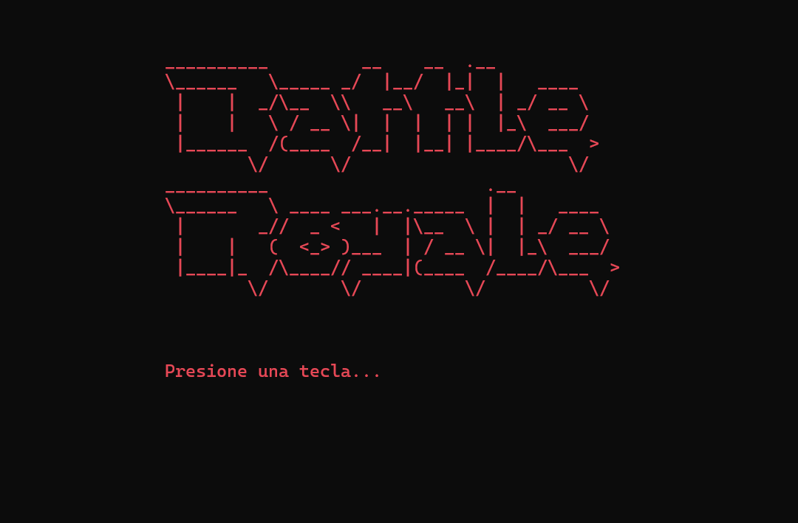

## Taller de Lenguajes 1 - Proyecto Final - Miguel Juárez
# Battle Royal - Un juego de consola C# con un toque de League of Legends

Este juego te sumerge en un emocionante Battle Royal donde podrás elegir a tu campeón favorito de League of Legends y luchar por la supervivencia contra otros poderosos personajes.

## Mecánica del juego:

El juego se desarrolla en una serie de rondas. En cada ronda, tu campeón se enfrentará a un oponente aleatorio en un combate por turnos. El daño se calcula en base a las estadísticas del campeón (obtenidas de la API de Riot Games) y un factor de azar.  La mitad de los campeones son eliminados al final de cada ronda, y el último campeón en pie es declarado vencedor.

## Características:

* **Personajes de League of Legends:** Los datos de los campeones, incluyendo sus nombres, estadísticas y roles (asesino, mago, tanque, etc.), se obtienen de la API de Riot Games. 
* **Sistema de combate por turnos:** Las batallas se simulan automáticamente, mostrando el daño infligido por cada campeón en cada turno.
* **Animaciones:** El juego incluye animaciones de inicio, fin de juego y  transiciones entre rondas utilizando arte ASCII.
* **Historial de ganadores:** El juego guarda un historial de los campeones que han logrado la victoria.
* **Menú interactivo:** Un menú en consola permite al jugador iniciar un nuevo juego, ver el historial de ganadores o salir del juego.

## Implementación:

El juego está implementado en C# utilizando el framework .NET. Se utiliza el patrón MVC para organizar el código y Newtonsoft.Json para deserializar los datos JSON de la API.

## Integración de la API de Riot Games

Este proyecto utiliza la API de Riot Games (específicamente la API de Datos de Dragón) para obtener información sobre los campeones de League of Legends. Esta información incluye estadísticas base, nombres, títulos y más.

**Detalles de la Implementación:**

* **Clase `API`:**  Esta clase contiene el método `GetPersonajes()` que realiza una solicitud GET a la URL `https://ddragon.leagueoflegends.com/cdn/3.6.14/data/es_ES/champion.json`.
* **Deserialización:** La respuesta JSON se deserializa utilizando la librería `Newtonsoft.Json` en un objeto de tipo `PersonajeData`.
```csharp
class API
{
    public static async Task<List<Personaje>> GetPersonajes()
    {
        try
        {
            using (HttpClient client = new HttpClient())
            {
                string url = "https://ddragon.leagueoflegends.com/cdn/3.6.14/data/es_ES/champion.json";
                var response = await client.GetStringAsync(url);
                var championData = JsonConvert.DeserializeObject<PersonajeData>(response);
                return championData.Data.Values.ToList();
            }
        }
        catch (System.Exception ex)
        {
            Console.WriteLine($"Error: {ex.Message}");
            Console.ReadKey(true);
            return null;
        }
    }
}
```

* **`PersonajeData`:** Esta clase contiene un diccionario  `Data` donde la **clave** es una cadena que representa el ID del campeón y el **valor** es un objeto de tipo `Personaje`.
```csharp
public class PersonajeData
{
    public Dictionary<string, Personaje> Data { get; set; }
}
public class Personaje
{
    int nivel = 1;
    double salud = 0;
    double ataque = 0;
    public string Id { get; set; }
    public string Name { get; set; }
    public string Title { get; set; }
    public string Blurb { get; set; }
    public Info Info { get; set; }
    public Image Image { get; set; }
    public List<string> Tags { get; set; }
    public string Partype { get; set; }
    public Stats Stats { get; set; }
    public int Nivel { get => nivel; set => nivel = value; }
    public double Salud { get => salud; set => salud = value; }
    public double Ataque { get => ataque; set => ataque = value; }

    public Personaje(string id, string name, string title, string blurb, Info info, Image image, List<string> tags, string partype, Stats stats)
    {
        Id = id;
        Name = name;
        Title = title;
        Blurb = blurb;
        Info = info;
        Image = image;
        Tags = tags;
        Partype = partype;
        Stats = stats;
        Salud = stats.Hp;
        Ataque = stats.AttackDamage;
    }
}
```

* **Clases de Datos:** También se definen las clases `Info`, `Image`, y `Stats` para representar la estructura de los datos recibidos de la API. 
    
* **Clase `GameLoader`:**  Esta clase se encarga de cargar la lista de personajes. Si existe un archivo local "Personajes.json", lo carga desde allí. De lo contrario, llama al método `GetPersonajes()` de la clase `API` para obtener los datos de la API y los guarda en el archivo local para uso futuro.
```csharp
class GameLoader
{
    private List<Personaje> personajes = new List<Personaje>();
    public List<Personaje> Personajes { get => personajes;}
    public  async Task CargarPersonajes()
    { //*Metodo que prepara la lista de personajes que se  usara en el juego
        if (GameFile.Existe("Personajes.json"))
        {
            personajes = GameFile.LeerPersonajes("Personajes.json");
        }else
        {   
            //Usando la clase API
            personajes = await API.GetPersonajes();
            if (personajes != null)
            {
                GameFile.GuardarPersonajes(personajes);
            }else
            {
                //Usando la clase Factory
                for (int i = 0; i < 10; i++)
                {
                    personajes.Add(Factory.CreatePersonaje());
                }
            }
        }
    }
}
```
**Referencias:**

* **API de Datos de Dragón:** [https://riot-api-libraries.readthedocs.io/en/latest/ddragon.html](https://riot-api-libraries.readthedocs.io/en/latest/ddragon.html)
* **Newtonsoft.Json:** [https://www.newtonsoft.com/json](https://www.newtonsoft.com/json)
### Imagenes del Juego:



## Para jugar:

**Visual Studio:**

1.  Clona este repositorio.
2.  Abre el proyecto en Visual Studio
3.  Compila y ejecuta la aplicación.

**Visual Studio Code:**

1.  Clona este repositorio.
2.  Abre la carpeta del proyecto en Visual Studio Code.
3.  Asegúrate de tener la extensión C# instalada.
4.  Abre el terminal integrado y navega hasta la carpeta del proyecto.
5.  Ejecuta el comando `dotnet run` para compilar y ejecutar la aplicación.

¡Disfruta de la batalla!